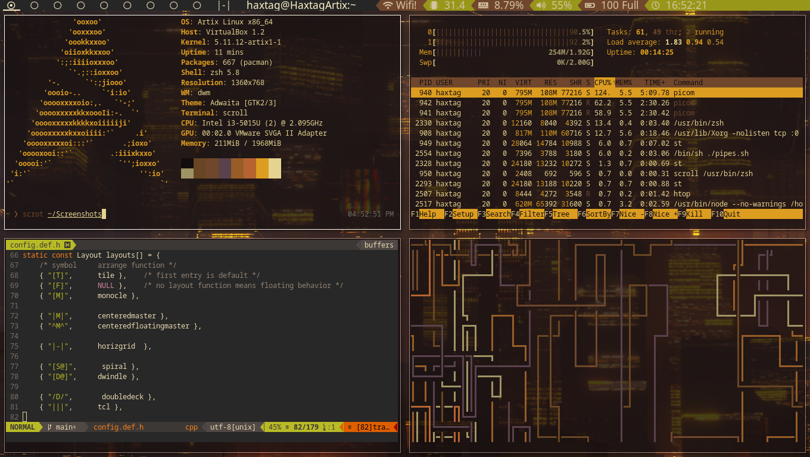
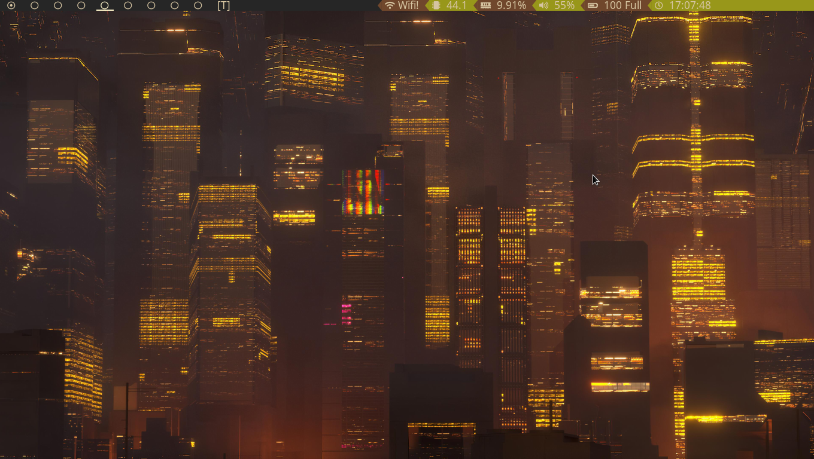

## Suckless Programs

<h1 align="center"> My DWM, Dmenu, Slock and st setup </h1>

Suckless programs strive to be minimal, open-source and no-bloat. <br>
Check out their website <a href="https://suckless.org"> suckless.org </a> 


# Features 

* DWM   
   DWM (Dynamic Window Manager) is window manager that has both  
   tiling and floating layouts. What makes this special is that it  
   is configured by editing the source code directory.  
   This keeps it very minimal. Also, I ahve changed the default modkey from ALT to Super Key(Windows key)    
   * Patches   
       active-indicator-bar(not using anymore but you can if you wish, just comment out the lines)    

       underline-tags   

       bar-height (17px)   

       barpadding 

       cyclelayout   

       pertag  

       swallow   

       Alternative tags indicators    

       restartsig

       fullgaps   

       always-center  

       statuscolors   

       rotatestack   

       centered-master layout   

       deck layout   

       tatami layout   

       three column layout   

       fibonacci (spiral, dwindle) layout   

       horizgrid layout   


* Dmenu      
   Dmenu is an apllication launcher      
      * Patches   

          border   
       
          center   

          grid   

          linehieght   

          numbers   

          fuzzymatch   

          fuzzyhighlight   


* Slock   
   Slock is the simple screen locker   

    * Patches   

        capscolor   

        message   

        quickcancel   

* St    
   St is the simple terminal. I'm using Luke Smith's build of St.    
   <a href="https://github.com/lukesmithxyz/st" > Which can be found here </a>     
       
      

# Installation

Clone this repo on to your local machine 


Compile the programs 
```shell
cd suckless
cd <enter program directory name>
make clean install
```

Example installation for dwm
```shell
cd suckless
cd dwm
make clean install
```

## Picture/Rice

# Rice
Colorscheme is gruvbox   

Busy   
   

Clean   
   
Dmenu   


